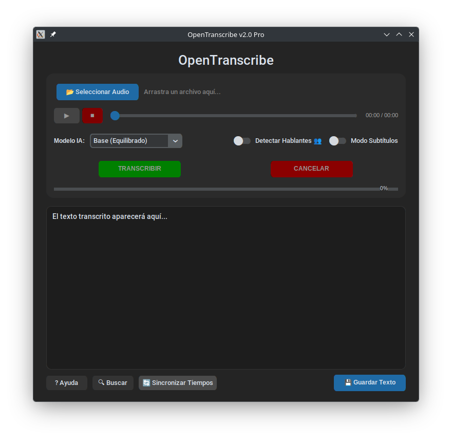

```markdown
# OpenTranscribe 🎙️

Una aplicación de escritorio moderna y oscura para transcribir audio a texto utilizando la potencia de Whisper (C++).



## Características 🚀
- **Interfaz "Dark Mode"** profesional con CustomTkinter.
- **Transcribe a múltiples formatos:** Word (.docx), CSV, SRT, VTT y TXT.
- **Diarización:** Detección experimental de hablantes.
- **Ligero:** Utiliza `whisper.cpp` para un rendimiento alto y bajo consumo de memoria.
- **Editor Karaoke:** Reproductor integrado que resalta el texto mientras se escucha.

## Requisitos 🛠️
1. Python 3.10+
2. **FFmpeg** instalado en el sistema.
   - Linux: `sudo apt install ffmpeg`
   - Windows: Descargar y añadir al PATH.

## Instalación 📦

1. Clona el repositorio:
   ```bash
   git clone [https://github.com/TU_USUARIO/OpenTranscribe.git](https://github.com/TU_USUARIO/OpenTranscribe.git)
   cd OpenTranscribe

```

2. Instala las dependencias:
```bash
pip install -r requirements.txt

```


3. (Opcional) Compila whisper.cpp si no usas el binario predeterminado.

## Uso ▶️

Ejecuta el archivo principal:

```bash
python main.py

```

La aplicación descargará automáticamente los modelos necesarios en tu carpeta de usuario.

## Licencia 📄

MIT License

```
