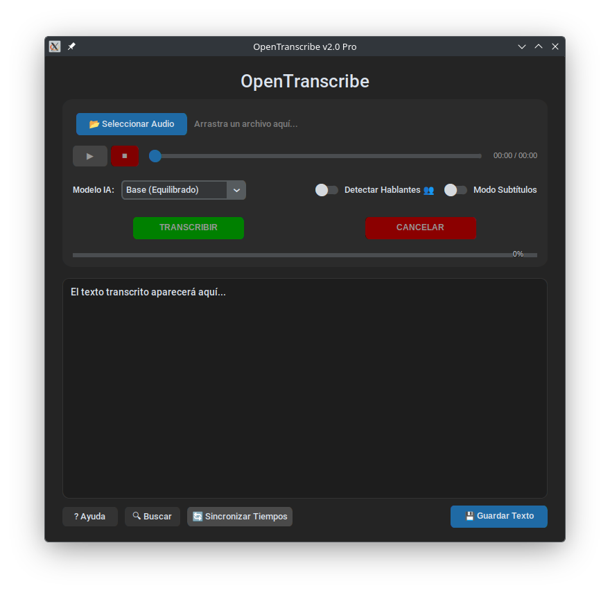

# OpenTranscribe 🎙️

<p align="center">
  
</p>

<p align="center">
  <strong>Transcribe audio y vídeo a texto en tu propio ordenador, sin conexión y sin enviar nada a la nube, con la potencia de Whisper (C++).</strong>
</p>

<p align="center">
  
  
  
  
  
</p>

<p align="center">
  
</p>

---

## 🚀 Características

- **100 % local:** el audio nunca sale de tu ordenador. Solo se usa internet para descargar los modelos la primera vez.
- **Audio y vídeo:** MP3, WAV, M4A, MP4, MKV, MOV, AVI, WEBM y FLV. No hace falta extraer el audio antes.
- **Varios modelos:** desde *Tiny* (muy rápido) hasta *Large* (máxima precisión). Se descargan automáticamente cuando hacen falta.
- **Exporta a múltiples formatos:** Word (.docx), CSV, SRT, VTT y TXT.
- **Modo cola:** arrastra varios archivos a la vez y se transcriben y guardan uno tras otro automáticamente.
- **Hablantes por canal:** en grabaciones estéreo con cada persona en un canal (llamadas, podcasts), identifica quién habla (izquierdo = Hablante 1, derecho = Hablante 2).
- **Editor Karaoke:** reproductor integrado que resalta el texto mientras se escucha.
- **Buscar y reemplazar** para corregir la transcripción antes de guardarla.
- **Interfaz oscura** con CustomTkinter y arrastrar y soltar archivos.

---

## 🛠️ Requisitos

- **Linux x86-64** con un procesador compatible con AVX2 (prácticamente cualquiera desde 2013-2015).
- **FFmpeg** instalado en el sistema:
  - Debian/Ubuntu: `sudo apt install ffmpeg`
  - Fedora: `sudo dnf install ffmpeg` (desde RPM Fusion)
  - openSUSE: `sudo zypper install ffmpeg` (el de los repositorios oficiales es suficiente)
- Para ejecutar desde el código fuente: **Python 3.10+**, `git`, `cmake` y `g++`.

---

## 📦 Instalación

### Desde paquetes precompilados

Descarga el paquete desde [Releases](https://github.com/AnabasaSoft/OpenTranscribe/releases):

- **Debian/Ubuntu (.deb):**
  ```bash
  sudo apt install ./OpenTranscribe-linux-x64.deb
  ```

- **Fedora (.rpm):**
  ```bash
  sudo dnf install ./OpenTranscribe-linux-x64.rpm
  ```

- **openSUSE Tumbleweed / Leap (.rpm):**
  ```bash
  sudo zypper install ./OpenTranscribe-linux-x64.rpm
  ```
  Basta con el FFmpeg de los repositorios oficiales: OpenTranscribe solo necesita leer el audio, y ese FFmpeg decodifica AAC, MP3, Opus, Vorbis o FLAC, también dentro de vídeos MP4 o MKV. No hace falta Packman.

- **Sin instalar (cualquier distribución):**
  ```bash
  tar xzf OpenTranscribe-linux-x64.tar.gz
  ./OpenTranscribe/OpenTranscribe
  ```

Los paquetes funcionan en distribuciones con glibc 2.35 o superior (Ubuntu 22.04, Debian 12, Fedora 36, openSUSE Leap 15.6 o posteriores).

### Desde el código fuente

1. Clona el repositorio:
   ```bash
   git clone https://github.com/AnabasaSoft/OpenTranscribe.git
   cd OpenTranscribe
   ```

2. Instala las dependencias:
   ```bash
   pip install -r requirements.txt
   ```

3. Compila el motor de transcripción:
   ```bash
   ./build_whisper.sh
   ```
   Genera `binaries_linux/whisper-cli` a partir de whisper.cpp.

---

## ▶️ Uso

```bash
python main.py
```

1. Arrastra un archivo de audio o vídeo a la ventana (o pulsa **📂 Seleccionar Audio**).
2. Elige el **modelo IA**. *Base* es un buen equilibrio entre velocidad y precisión.
3. Activa **Modo Subtítulos** si quieres marcas de tiempo (necesarias para SRT/VTT y para el karaoke).
4. Pulsa **TRANSCRIBIR** y, al terminar, **💾 Guardar Texto**.

Si arrastras **varios archivos**, se activa el modo cola: eliges una vez el formato y la carpeta de destino, y cada transcripción se guarda automáticamente.

Los modelos se guardan en `~/.OpenTranscribe/models/`.

---

## 📄 Licencia

Este proyecto está bajo la **GNU General Public License v3.0 (GPL-3.0)**.
Ver el archivo `LICENSE` para el texto completo.

Copyright (C) 2025-2026 AnabasaSoft

### Qué significa en la práctica

- ✅ Puedes **usar** OpenTranscribe libremente, también en tu empresa y con fines comerciales
- ✅ Puedes **estudiar, modificar y redistribuir** el código
- ⚠️ Si distribuyes una versión modificada, debes publicarla **también bajo GPL-3.0** y facilitar su código fuente
- ⚠️ Debes mantener los avisos de copyright y licencia

### Aviso de licencia

```
OpenTranscribe - Transcripción local de audio y vídeo
Copyright (C) 2025-2026 AnabasaSoft

Este programa es software libre: puedes redistribuirlo y/o modificarlo bajo
los términos de la Licencia Pública General de GNU publicada por la Free
Software Foundation, ya sea la versión 3 de la Licencia o (a tu elección)
cualquier versión posterior.

Este programa se distribuye con la esperanza de que sea útil, pero SIN
NINGUNA GARANTÍA; ni siquiera la garantía implícita de COMERCIABILIDAD o
IDONEIDAD PARA UN PROPÓSITO PARTICULAR. Consulta la Licencia Pública
General de GNU para más detalles.

Deberías haber recibido una copia de la Licencia Pública General de GNU
junto con este programa. Si no, consulta <https://www.gnu.org/licenses/>.
```

> **Nota sobre licencias comerciales**: AnabasaSoft es el titular único del
> copyright de OpenTranscribe y, por tanto, puede ofrecer el mismo código bajo
> condiciones distintas a la GPL. Si necesitas integrar OpenTranscribe en un
> producto propietario, ponte en contacto.

---

## 📧 Contacto

**AnabasaSoft**

- 📧 Email: [anabasasoft@gmail.com](mailto:anabasasoft@gmail.com)
- 🌐 GitHub: [github.com/AnabasaSoft](https://github.com/AnabasaSoft)
- 💼 Proyecto: [github.com/AnabasaSoft/OpenTranscribe](https://github.com/AnabasaSoft/OpenTranscribe)

---

## 🙏 Agradecimientos

- [whisper.cpp](https://github.com/ggml-org/whisper.cpp): motor de transcripción en C/C++ basado en Whisper de OpenAI
- [FFmpeg](https://ffmpeg.org/): conversión y lectura de audio y vídeo
- [CustomTkinter](https://github.com/TomSchimansky/CustomTkinter): interfaz gráfica moderna sobre Tkinter
- [tkinterdnd2](https://github.com/Eliav2/tkinterdnd2): arrastrar y soltar archivos
- [pygame](https://www.pygame.org/): reproducción de audio para el modo karaoke
- [python-docx](https://github.com/python-openxml/python-docx): exportación a Word
- [Pillow](https://python-pillow.org/): tratamiento de imágenes
- La comunidad open source, por su apoyo y sus contribuciones

---

<div align="center">


**Desarrollado con ❤️ por [Anabasa Software](https://anabasasoft.github.io)**

📧 Email: [anabasasoft@gmail.com](mailto:anabasasoft@gmail.com) • 🌐 Portafolio: [anabasasoft.github.io](https://anabasasoft.github.io)

⭐ Si te gusta este proyecto, dale una estrella en GitHub

</div>

<div align="center">
  <br/>
  <p><code>>_ sudo buy-me-a-coffee --theme=dark --force</code></p>
  <a href="https://www.buymeacoffee.com/danitxu" target="_blank">
    
  </a>
  <br/>
</div>
